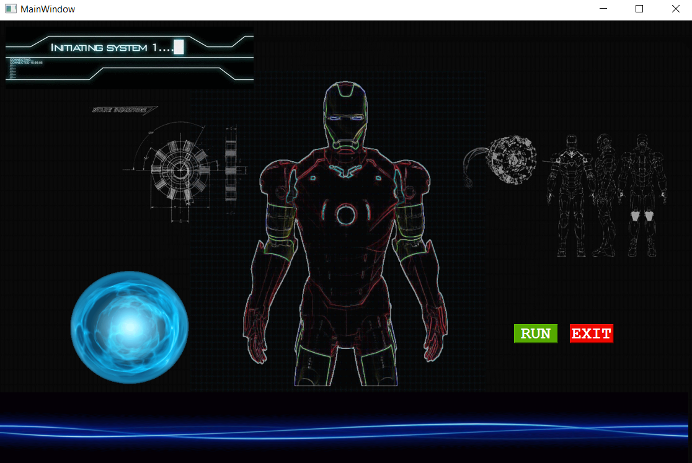

# 🌟 Neon - Your Personal AI Assistant 🌟

Neon is a highly interactive and versatile personal AI assistant inspired by Iron Man's JARVIS. It is designed to provide a wide array of features and functionalities, built entirely using Python with a PyQt5-powered frontend.

---

## 🧠 About
Neon combines the power of speech recognition, natural language processing, and a user-friendly graphical interface to offer a seamless personal assistant experience. It can assist with tasks like opening applications, fetching information, automating tasks, and much more, all while engaging in conversational interactions.

---

## 🛠️ Requirements
To run Neon, ensure you have the following requirements installed on your system:

- **Python 3.8 or higher**
- **Required Modules:**
  - PyQt5
  - pyttsx3
  - speech_recognition
  - datetime
  - os
  - cv2
  - requests
  - time
  - json
  - string
  - re
  - webbrowser
  - pywhatkit
  - sys
  - word2number
  - pyjokes
  - contacts
  - vobject
  - pyautogui
  - instadownloader
  - instaloader
  - operator
  - bs4
  - pywikihow
  - psutil

You can install these dependencies using the following command:

```bash
pip install pyttsx3 speechrecognition opencv-python requests pywhatkit word2number pyjokes vobject pyautogui instaloader beautifulsoup4 pywikihow psutil PyQt5
```

---

## ✨ Features
- 🎙️ **Speech Recognition:** Hands-free operation with voice commands.
- 🗣️ **Text-to-Speech:** Conversational responses using a natural-sounding voice.
- 🖥️ **Graphical User Interface:** PyQt5-powered interface for smooth interaction.
- 🔄 **Task Automation:** Automates repetitive tasks like opening applications, web searches, and system monitoring.
- 🌐 **Web Scraping:** Fetches data and answers questions from the web.
- 📲 **Social Media Integration:** Downloads Instagram content effortlessly.
- 🎶 **Entertainment:** Plays music, videos, and provides jokes.
- 📚 **Knowledge Base:** Leverages Wikipedia and WikiHow for reliable information.
- 🖥️ **System Monitoring:** Displays CPU and memory usage statistics.

---

## 📸 Screenshots
Here are some snapshots of Neon's interface and features:

- **Home Screen:**
  
---

## 🚀 How to Run
Follow these steps to get Neon up and running on your system:

1. **Clone the Repository:**
   ```bash
   git clone https://github.com/yourusername/neon.git
   cd neon
   ```
2. **Install Dependencies:**
   ```bash
   pip install -r requirements.txt
   ```
3. **Launch the Application:**
   ```bash
   python main.py
   ```

---

## 🚧 Future Enhancements
Neon is constantly evolving! Here are some planned upgrades:

- 🌟 **IoT Device Integration:** Control smart home devices seamlessly.
- 🧠 **Advanced NLP:** Enhanced natural language processing for better understanding.
- 📱 **Cross-Platform Support:** Expand compatibility across various operating systems.

---

## 🤝 Contributing
Contributions are always welcome! To contribute:

1. Fork the repository.
2. Create a new branch for your feature or bug fix.
3. Commit your changes and submit a pull request.

For major changes, please open an issue first to discuss what you would like to change.

---

## 📜 License
This project is licensed under the MIT License. See the [LICENSE](LICENSE) file for details.

---
